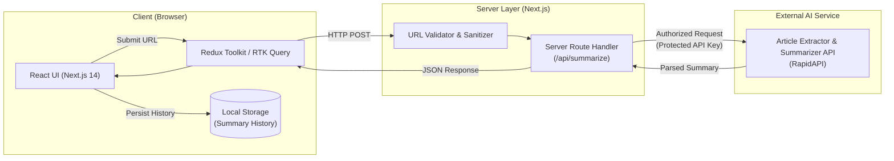

# AI Link Summarizer — Rapid Article Summarization Web App

An AI-powered web application built with **Next.js 14**, **React 18**, **Redux Toolkit (RTK Query)**, and **Tailwind CSS**. It transforms lengthy web articles into clear, concise summaries using AI, complete with server-side API proxy protection, URL validation, and local history management.


---

## 🚀 Key Features

- **⚡ Fast AI Summarization**: Extract and condense long articles, blog posts, and news pieces into concise summaries in seconds.
- **🛡️ Secure Server-Side Proxy**: API credentials remain completely hidden on the server via Next.js Route Handlers (`/api/summarize`), preventing key leakage in client bundles.
- **🔗 Smart URL Validation & Error Handling**: Client and server-side URL validation with descriptive feedback for malformed URLs, unreachable sites, and network timeouts.
- **💾 Local History Persistence**: Automatically stores past summaries in browser local storage with one-click re-inspection and easy deletion.
- **📋 Copy to Clipboard**: Instant one-click copy functionality for summarized content and article URLs with responsive visual confirmation.
- **📱 Fully Responsive Design**: Polished, modern UI styled with Tailwind CSS, supporting mobile, tablet, and desktop screens.

---

## 🏗️ Architecture & Request Flow



---

## 💻 Tech Stack

| Layer | Technology |
|---|---|
| **Framework** | [Next.js 14](https://nextjs.org/) (App Router), [React 18](https://react.dev/) |
| **State Management & Data Fetching** | [Redux Toolkit](https://redux-toolkit.js.org/), [RTK Query](https://redux-toolkit.js.org/rtk-query/overview) |
| **Styling** | [Tailwind CSS](https://tailwindcss.com/), [PostCSS](https://postcss.org/) |
| **AI Integration** | RapidAPI Article Extractor and Summarizer |
| **Storage** | Browser Local Storage API |

---

## 📁 Repository Structure

```text
├── app/                  # Next.js 14 App Router
│   ├── api/summarize/    # Protected server-side API proxy route
│   ├── layout.js         # Root layout with metadata and styles
│   └── page.js           # Main application view
├── components/           # UI components (Hero, Summarizer, History, Navbar)
├── lib/                  # Redux store and RTK Query API slice definitions
├── public/               # Static assets, logos, and preview screenshots
└── tailwind.config.js    # Tailwind CSS design system configuration
```

---

## ⚙️ Getting Started

### Prerequisites
- **Node.js**: v18.0.0 or higher
- **npm** or **yarn**
- **RapidAPI Key**: with access to the [Article Extractor and Summarizer API](https://rapidapi.com/restyler/api/article-extractor-and-summarizer)

### 1. Clone the Repository
```bash
git clone https://github.com/ubaidullah-ctrl/ai-link-summarizer.git
cd ai-link-summarizer
```

### 2. Install Dependencies
```bash
npm install
```

### 3. Configure Environment Variables
Create a `.env.local` file in the root directory:
```bash
# On Linux/macOS:
cp .env.example .env.local

# On Windows PowerShell:
Copy-Item .env.example .env.local
```

Add your RapidAPI key to `.env.local`:
```env
RAPID_API_KEY=your_rapidapi_key_here
```

### 4. Run the Development Server
```bash
npm run dev
```

Open [http://localhost:3000](http://localhost:3000) in your browser to test the application.

---

## 🔒 Security Best Practices
- **Credential Protection**: The RapidAPI key is never bundled in client-side code; all requests are proxied via server-only Next.js API routes.
- **Input Sanitization**: Submitted URLs are strictly validated prior to dispatching external HTTP requests.

---

## 👨‍💻 Author

**Ubaid Ullah**
- **Portfolio**: [Portfolio Website](https://my-portfolio-website-plum-theta.vercel.app/)
- **GitHub**: [@ubaidullah-ctrl](https://github.com/ubaidullah-ctrl)
- **LinkedIn**: [ubaid-ullah-](https://www.linkedin.com/in/ubaid-ullah-/)
- **Email**: [ubaidullah3048@gmail.com](mailto:ubaidullah3048@gmail.com)

---

## 📄 License
This project is licensed under the MIT License - see the [LICENSE](./LICENSE) file for details.
