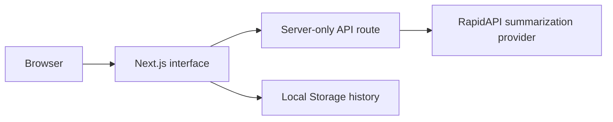

# AI Link Summarizer

A responsive Next.js application that accepts article URLs and returns concise AI-generated summaries.


## Overview

AI Link Summarizer provides a focused workflow for readers who want to evaluate a long article quickly. A user submits a public article URL, the application requests a summary from the Article Extractor and Summarizer API on RapidAPI, and successful results are stored locally for later reuse.

This repository is an adapted project. See [Attribution](#attribution) for the original source and the verified changes in this copy.

## Features

- Browser URL validation
- Asynchronous summary requests with loading and error states
- Server-side RapidAPI proxy so the API key is not included in the client bundle
- Summary output and URL copy interaction
- Local summary history stored in the browser
- Responsive interface built with Tailwind CSS

## My Contribution

My verified changes in this copy include:

- Updated the project branding and repository links
- Added safer environment-file handling and removed a local exposed credential
- Moved RapidAPI authentication from client configuration to a server-only Next.js route
- Added server-side URL validation and structured provider failure responses
- Corrected state handling so rendering history does not mutate React state
- Reworked the documentation, setup instructions, limitations, and attribution

The original interface and core summarisation workflow were created in the upstream project credited below.

## Technology Stack

- Next.js 14 and React 18
- JavaScript
- Redux Toolkit, RTK Query, and React Redux
- Tailwind CSS
- RapidAPI Article Extractor and Summarizer API
- Browser Local Storage

## Architecture



The browser calls `/api/summarize`. The Next.js route validates the submitted URL and adds the RapidAPI credential on the server before contacting the external provider.

## Important Workflows

1. The URL input uses browser validation and submits through RTK Query.
2. The server route accepts HTTP or HTTPS URLs and rejects invalid input.
3. The route calls RapidAPI with a server-only credential.
4. The interface renders loading, error, or summary states.
5. Successful summaries are saved in Local Storage and can be selected again.

## Local Setup

Prerequisites: Node.js 18 or newer, npm, and a RapidAPI key with access to the Article Extractor and Summarizer API.

```bash
git clone https://github.com/ubaidullah-ctrl/AI---Summarizer.git
cd AI---Summarizer
npm install
```

Create the local environment file:

```bash
cp .env.example .env.local
```

On Windows PowerShell:

```powershell
Copy-Item .env.example .env.local
```

Replace the placeholder in `.env.local`, then start development:

```bash
npm run dev
```

Open `http://localhost:3000`.

## Environment Variables

| Variable | Purpose | Exposure |
|---|---|---|
| `RAPID_API_KEY` | Authenticates server-side RapidAPI requests | Server only |

Never commit `.env` or `.env.local`. If a real key has ever been committed, revoke and rotate it; deleting the current file does not remove it from Git history.

## Testing and Quality Commands

```bash
npm run lint
npm run build
```

No automated test suite or separate type-check command is currently configured.

## Current Limitations

- Summary availability depends on a third-party API and its quota.
- The server route does not yet implement rate limiting.
- Summary history is local to one browser and has no account sync.
- Automated tests are not configured.
- A stable production deployment has not been verified.

## Future Improvements

- Add per-IP rate limiting and request timeouts.
- Add route and interface tests for success, invalid input, quota failures, and provider outages.
- Add history deletion and storage limits.
- Verify the complete workflow in production before publishing a live-demo link.

## Attribution

This project was initially based on [minhajhameed/nextjs-ai-summarizer](https://github.com/minhajhameed/nextjs-ai-summarizer). The upstream project supplied the original Next.js interface, Redux-based request flow, styling, and RapidAPI integration.

The retained license continues to credit the original copyright holder. The background styling also retains its source comment crediting the referenced design inspiration.

## License

See [LICENSE](./LICENSE). The existing licence and original copyright notice have been preserved.
